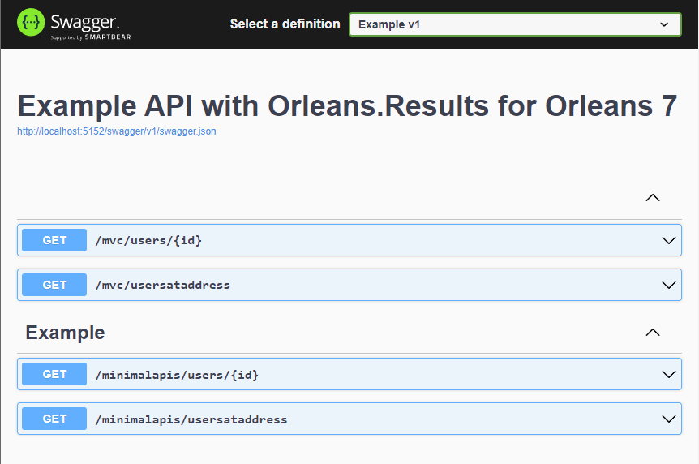

#  Orleans.Results
Concise, version-tolerant result pattern implementation for [Microsoft Orleans 4](https://github.com/dotnet/orleans/releases/tag/v4.0.0-preview1).

The result pattern solves a common problem: it returns an object indicating success or failure of an operation instead of throwing/using exceptions (see [why](#why) below).

This implementation leverages [immutability in Orleans](https://github.com/dotnet/orleans/blob/b7bb116ba4f98b64428d449d26f20ea37d3501b6/src/Orleans.Serialization.Abstractions/Annotations.cs#L430) to optimize performance.

## Usage

Define error codes:
```csharp
public enum ErrorCode
{
    UserNotFound = 1
}
```
> Note that this enum is used to define convenience classes:<br />`Result : ResultBase<ErrorCode>` and `Result<T> : ResultBase<ErrorCode, T>`<br />These classes save you from having to specify `<ErrorCode>` in every grain method signature

Grain contract:
```csharp
interface ITenant : IGrainWithStringKey
{
    Task<Result<string>> GetUser(int id);
}
```
Use in ASP.NET Core minimal API's:
```csharp
app.MapGet("minimalapis/users/{id}", async (IClusterClient client, int id)
 => await client.GetGrain<ITenant>("").GetUser(id) switch
    {
        { IsSuccess: true                   } r => Results.Ok(r.Value),
        { ErrorCode: ErrorCode.UserNotFound } r => Results.NotFound(r.ErrorsText),
        {                                   } r => throw r.UnhandledErrorException()
    }
);
```
Use in ASP.NET Core MVC:
```csharp
[HttpGet("mvc/users/{id}")]
public async Task<ActionResult<string>> GetUser(int id)
 => await client.GetGrain<ITenant>("").GetUser(id) switch
    {
        { IsSuccess: true                   } r => Ok(r.Value),
        { ErrorCode: ErrorCode.UserNotFound } r => NotFound(r.ErrorsText),
        {                                   } r => throw r.UnhandledErrorException()
    };
```
Grain implementation:
```csharp
class Tenant : Grain, ITenant
{
    public Task<Result<string>> GetUser(int id) => Task.FromResult<Result<string>>(
        id >= 0 && id < S.Users.Count ?
            S.Users[id] :
            Errors.UserNotFound(id)
    );
}

static class Errors
{
    public static Result.Error UserNotFound(int id) => new(ErrorCode.UserNotFound, $"User {id} not found");
}
```

The `Result` convenience classes have implicit convertors to allow concise assignment of errors and values, e.g.
```csharp
    Result<string> r1 = ErrorCode.UserNotFound;
    Result<string> r2 = "Hi";
    Result<string> r3 = (ErrorCode.UserNotFound, $"User {id} not found");
```
The `With` methods allow you to specify multiple errors in a result:
```csharp
    Result<string> r = ErrorCode.AnError;
    var r2 = r
        .With(ErrorCode.AnotherError)
        .With(ErrorCode.YetAnotherError, "This is the 3rd error");
```
The `ValidationErrors` property is convenient to for use with [ValidationProblemDetails](https://docs.microsoft.com/en-us/dotnet/api/microsoft.aspnetcore.mvc.validationproblemdetails?view=aspnetcore-6.0) (in MVC):<br>
```csharp
r => ValidationProblem(new ValidationProblemDetails(r.ValidationErrors))
```
and for [Results.ValidationProblem](https://docs.microsoft.com/en-us/dotnet/api/microsoft.aspnetcore.http.results.validationproblem?view=aspnetcore-6.0) (in minimal API's):
```csharp
r => Results.ValidationProblem(r.ValidationErrors)
```
The [example in the repo](https://github.com/Applicita/Orleans.Results/tree/main/src/Example) demonstrates using Orleans.Results with both ASP.NET Core minimal API's and MVC:

## How do I get it?
1) On the command line, ensure that the [template](https://github.com/Applicita/Modern.CSharp.Templates) is installed:
    ```
    dotnet new --install Modern.CSharp.Templates
    ```
2) In or below the project folder that contains grain interfaces (or that is referenced by projects that contain grain interfaces), type:
    ```
    dotnet new mcs-orleans-results
    ```
    This will add the [ErrorCode.cs](https://github.com/Applicita/Orleans.Results/blob/main/src/ErrorCode.cs) and [Result.cs](https://github.com/Applicita/Orleans.Results/blob/main/src/Result.cs) files there (if you prefer, you can copy the files there manually)

3) Update the `Example` namespace in the added files to match your project
4) Edit the `ErrorCode` enum to define error codes

## Why?
The result pattern solves a common problem: it returns an object indicating success or failure of an operation instead of throwing/using exceptions.

### Using exceptions for flow control is an antipattern:
- It degrades performance: see [MS profiling rule da0007](https://docs.microsoft.com/en-us/visualstudio/profiling/da0007-avoid-using-exceptions-for-control-flow)
- It degrades code readability and maintainability:<br />it is easy to miss expected flows when exceptions are used; an exception raised in a called method can exit the current method without any indication that this is intentional and expected.

  Checking return values and returning them to the caller makes the expected flows clear and explicit in context in the code of every method.

  Using return values also allows you to use [code analysis rule CA1806](https://docs.microsoft.com/en-us/dotnet/fundamentals/code-analysis/quality-rules/ca1806) to alert you where you forgot to check the return value (you can use a *discard* `_ =` to express intent to ignore a return value)

### Orleans 4 introduces version-tolerant, high-performance serialization
However this is not compatible with existing Result pattern implementations like [FluentResults](https://github.com/altmann/FluentResults). The result object must be annotated with the Orleans `[GenerateSerializer]` and `[Id]` attributes, and cannot contain arbitrary objects.

Orleans.Results adheres to these guidelines, which enables compatibility with future changes in the result object serialization.