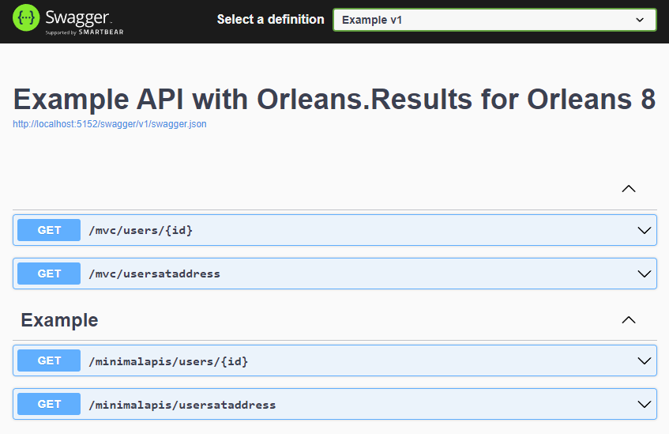

#  Orleans.Results
Concise, version-tolerant result pattern implementation for [Microsoft Orleans 7](https://github.com/dotnet/orleans/releases/tag/v7.0.0-rc2).

The result pattern solves a common problem: it returns an object indicating success or failure of an operation instead of throwing exceptions (see [why](#why) below).

This implementation leverages [immutability to optimize performance](#immutability-and-performance). Even though it is fully tested (100% code coverage), Orleans.Results will remain in preview until Orleans 7 is GA.

## Basic usage

Define error codes:
```csharp
public enum ErrorCode
{
    UserNotFound = 1
}
```
> Note that this enum is used to define convenience classes:<br />`Result : ResultBase<ErrorCode>` and `Result<T> : ResultBase<ErrorCode, T>`<br />These classes save you from having to specify `<ErrorCode>` as type parameter in every grain method signature

Grain contract:
```csharp
interface ITenant : IGrainWithStringKey
{
    Task<Result<string>> GetUser(int id);
}
```
Use in ASP.NET Core minimal API's:
```csharp
app.MapGet("minimalapis/users/{id}", async (IClusterClient client, int id)
 => await client.GetGrain<ITenant>("").GetUser(id) switch
    {
        { IsSuccess: true                   } r => Results.Ok(r.Value),
        { ErrorCode: ErrorCode.UserNotFound } r => Results.NotFound(r.ErrorsText),
        {                                   } r => throw r.UnhandledErrorException()
    }
);
```
Use in ASP.NET Core MVC:
```csharp
[HttpGet("mvc/users/{id}")]
public async Task<ActionResult<string>> GetUser(int id)
 => await client.GetGrain<ITenant>("").GetUser(id) switch
    {
        { IsSuccess: true                   } r => Ok(r.Value),
        { ErrorCode: ErrorCode.UserNotFound } r => NotFound(r.ErrorsText),
        {                                   } r => throw r.UnhandledErrorException()
    };
```
Grain implementation:
```csharp
class Tenant : Grain, ITenant
{
    public Task<Result<string>> GetUser(int id) => Task.FromResult<Result<string>>(
        id >= 0 && id < S.Users.Count ?
            S.Users[id] :
            Errors.UserNotFound(id)
    );
}

static class Errors
{
    public static Result.Error UserNotFound(int id) => new(ErrorCode.UserNotFound, $"User {id} not found");
}
```

## Convenience features
The `Result<T>` class is intended for methods that return either a value or error(s), while the `Result` class is intended for methods that return either success (`Result.Ok`) or error(s).

The `Result` and `Result<T>` convenience classes have implicit convertors to allow concise returning of errors and values:
```csharp
async Task<Result<string>> GetString(int i) => i switch {
    0 => "Success!",
    1 => ErrorCode.NotFound,
    2 => (ErrorCode.NotFound, "Not found"),
    3 => new Error(ErrorCode.NotFound, "Not found"),
    4 => new List<Error>(/*...*/)
};
```
The implicit convertor only supports multiple errors with `List<Error>`; you can use the public constructor to specify multiple errors with any `IEnumerable<Error>`:
```csharp
async Task<Result<string>> GetString()
{
    IEnumerable<Error> errors = new HashSet<Error>();
    // ... check for errors
    if (errors.Any()) return new(errors);
    return "Success!";
}
```
## Validation errors
The `TryAsValidationErrors` method is covenient for returning [RFC7807](https://tools.ietf.org/html/rfc7807) based problem detail responses. This method is designed to be used with [ValidationProblemDetails](https://docs.microsoft.com/en-us/dotnet/api/microsoft.aspnetcore.mvc.validationproblemdetails?view=aspnetcore-6.0) (in MVC):<br>
```csharp
return result.TryAsValidationErrors(ErrorCode.ValidationError, out var validationErrors)
    ? ValidationProblem(new ValidationProblemDetails(validationErrors))

    : result switch
    {
        { IsSuccess: true } r => Ok(r.Value),
        { ErrorCode: ErrorCode.NoUsersAtAddress } r => NotFound(r.ErrorsText),
        { } r => throw r.UnhandledErrorException()
    };
```
and with [Results.ValidationProblem](https://docs.microsoft.com/en-us/dotnet/api/microsoft.aspnetcore.http.results.validationproblem?view=aspnetcore-6.0) (in minimal API's):
```csharp
return result.TryAsValidationErrors(ErrorCode.ValidationError, out var validationErrors)
    ? Results.ValidationProblem(validationErrors)

    : result switch
    {
        { IsSuccess: true                       } r => Results.Ok(r.Value),
        { ErrorCode: ErrorCode.NoUsersAtAddress } r => Results.NotFound(r.ErrorsText),
        {                                       } r => throw r.UnhandledErrorException()
    };
```

To use `TryAsValidationErrors`, your `ErrorCode` must be a `[Flags] enum` with a flag that identifies which error codes are validation errors:
```csharp
[Flags]
public enum ErrorCode
{
    NoUsersAtAddress = 1,

    ValidationError = 1024,
    InvalidZipCode = 1 | ValidationError,
    InvalidHouseNr = 2 | ValidationError,
}
```
`TryAsValidationErrors` will only return validation errors if the result is failed and **all** errors in it are validation errors; the method is designed to support a typical validation implementation pattern:
```csharp
public async Task<Result<string>> GetUsersAtAddress(string zip, string nr)
{
    List<Result.Error> errors = new();

    // First check for validation errors - don't perform the operation if there are any.
    if (!Regex.IsMatch(zip, @"^\d\d\d\d[A-Z]{2}$")) errors.Add(Errors.InvalidZipCode(zip));
    if (!Regex.IsMatch(nr, @"^\d+[a-z]?$")) errors.Add(Errors.InvalidHouseNr(nr));
    if (errors.Any()) return errors;

    // If there are no validation errors, perform the operation - this may return non-validation errors
    // ... do the operation
    if (...) errors.Add(Errors.NoUsersAtAddress($"{zip} {nr}"));
    return errors.Any() ? errors : "Success!";
}
```

## Immutability and performance
To optimize performance, `Result` and `Error` are implemented as immutable types and are marked with the Orleans [[Immutable] attribute](https://github.com/dotnet/orleans/blob/b7bb116ba4f98b64428d449d26f20ea37d3501b6/src/Orleans.Serialization.Abstractions/Annotations.cs#L430). This means that Orleans will not create a deep copy of these types for grain calls within the same silo, passing instance references instead.

The performance of `Result<T>` can be optimized similarly by judiciously marking specific `T` types as `[Immutable]` - exactly the same way as when you would directly pass `T` around, instead of `Result<T>`. The fact that `Result<T>` itself is not marked immutable does not significantly reduce the performance benefits gained; in cases where immutability makes a difference `T` typically has a much higher serialization cost than the wrapping result (which is very lightweight).
## Full example
The [example in the repo](https://github.com/Applicita/Orleans.Results/tree/main/src/Example) demonstrates using Orleans.Results with both ASP.NET Core minimal API's and MVC:

## How do I get it?
1) On the command line, ensure that the [template](https://github.com/Applicita/Modern.CSharp.Templates) is installed:
    ```
    dotnet new install Modern.CSharp.Templates
    ```

2) In or below the project folder that contains grain interfaces (or that is referenced by projects that contain grain interfaces), type:
    ```
    dotnet new mcs-orleans-results
    ```
    This will add the [ErrorCode.cs](https://github.com/Applicita/Orleans.Results/blob/main/src/ErrorCode.cs) and [Result.cs](https://github.com/Applicita/Orleans.Results/blob/main/src/Result.cs) files there (if you prefer, you can copy the files there manually)

3) Update the `Example` namespace in the added files to match your project
4) Edit the `ErrorCode` enum to define error codes

## Why?
The result pattern solves a common problem: it returns an object indicating success or failure of an operation instead of throwing/using exceptions.

### Using exceptions for flow control is an antipattern:
- It degrades performance: see [MS profiling rule da0007](https://docs.microsoft.com/en-us/visualstudio/profiling/da0007-avoid-using-exceptions-for-control-flow)
- It degrades code readability and maintainability:<br />it is easy to miss expected flows when exceptions are used; an exception raised in a called method can exit the current method without any indication that this is intentional and expected.

  Checking return values and returning them to the caller makes the expected flows clear and explicit in context in the code of every method.

  Using return values also allows you to use [code analysis rule CA1806](https://docs.microsoft.com/en-us/dotnet/fundamentals/code-analysis/quality-rules/ca1806) to alert you where you forgot to check the return value (you can use a *discard* `_ =` to express intent to ignore a return value)

### Orleans 7 introduces version-tolerant, high-performance serialization
However existing Result pattern implementations like [FluentResults](https://github.com/altmann/FluentResults) are not designed for serialization, let alone Orleans serialization. Orleans requires that you annotate your result types - including all types contained within - with the Orleans `[GenerateSerializer]` and `[Id]` attributes, or alternatively that you write additional code to serialize external types.

This means that result objects that can contain contain arbitrary objects as part of the errors (like exceptions) require an open-ended amount of work. Orleans.Results avoids this work by defining an error to be an `enum` code plus a `string` message.

Orleans.Results adheres to the Orleans 7 serialization guidelines, which enables compatibility with future changes in the result object serialization.